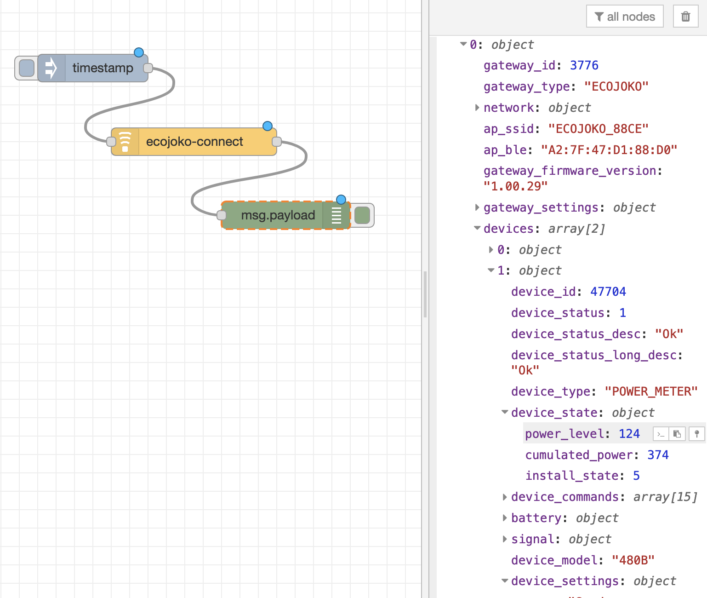

# node-red-contrib-ecojoko
node red extension for ecojoko api

In credentials settings, you must provide : 
- e-mail
- password

exemple with a command-line : 

    try {
        var { Ecojoko } = require("./ecojoko.js");
    } catch (ex) {
        var { Ecojoko } = require("./node_modules/node-red-contrib-ecojoko/ecojoko.js");
    }
    
    function main() {

    
        var ecojoko =  new Ecojoko("yannick.simon@gmail.com", "rs9f!T9rbKMv!BZV*VPix");
      
        ecojoko.getLoginCookies()
            .then(async  => {  
               gateways = ecojoko.getGateways()
               .then(async gateways => {
                console.log(JSON.stringify(gateways, null, 4));
               });
               
            }
            ).catch(err => {
                console.error(err);
                return;
            })
    }
    
    main()
